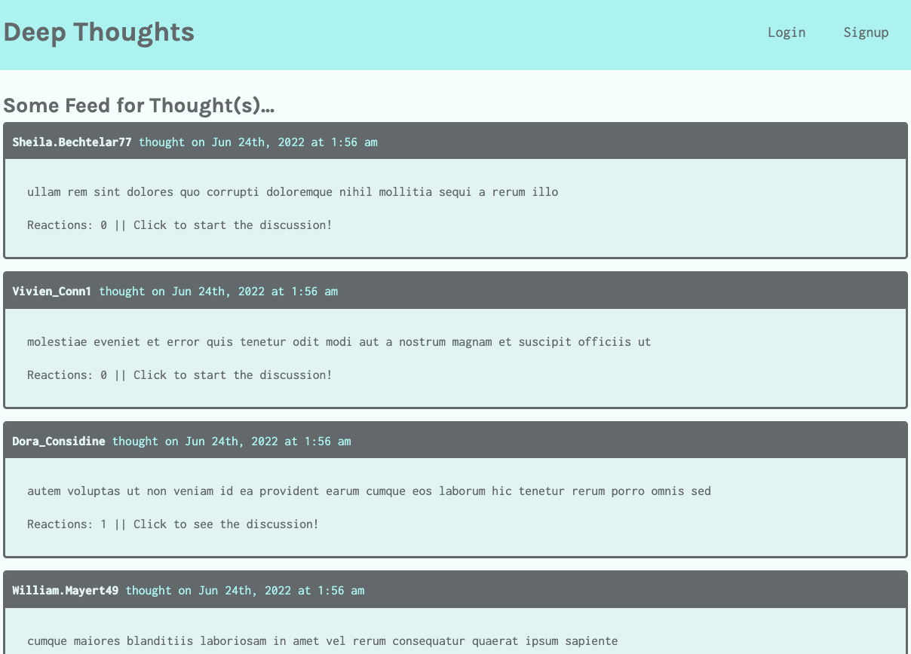

# Deep Thoughts - 

**A blog site that allows logged in Users to share thoughts, react to other users thoughts, and add friends!**

_Languages Used: MERN (MongoDB, Express.js, React.js, Node.js), GraphQL, Apollo server, Faker, Mongoose_

## Table of Contents:

1. [Installation Instructions](#installation-instructions)
2. [Usage instructions](#usage-instructions)
3. [Contributor Guidelines](#contributor-guidelines)
4. [Testing instructions](#testing-instructions)
5. [Questions / Contact Information](#questions)
6. [Walkthrough Video / Screenshots](#walkthrough)

### Installation Instructions:

Clone the repository from github and type "npm i" to install the dependencies.

### Usage Instructions:

Visit the deployed application OR seed the database with "npm run seed" and then type "npm run develop" in the CLI to start the front and back end.

### Contributor Guidelines:

Push to Github for review!

### Testing Instructions:

N / A

### Questions?

<aofish815@gmail.com>

Check out my **[Github](https://github.com/superfishal/deep-thoughts)**

### Walkthrough

